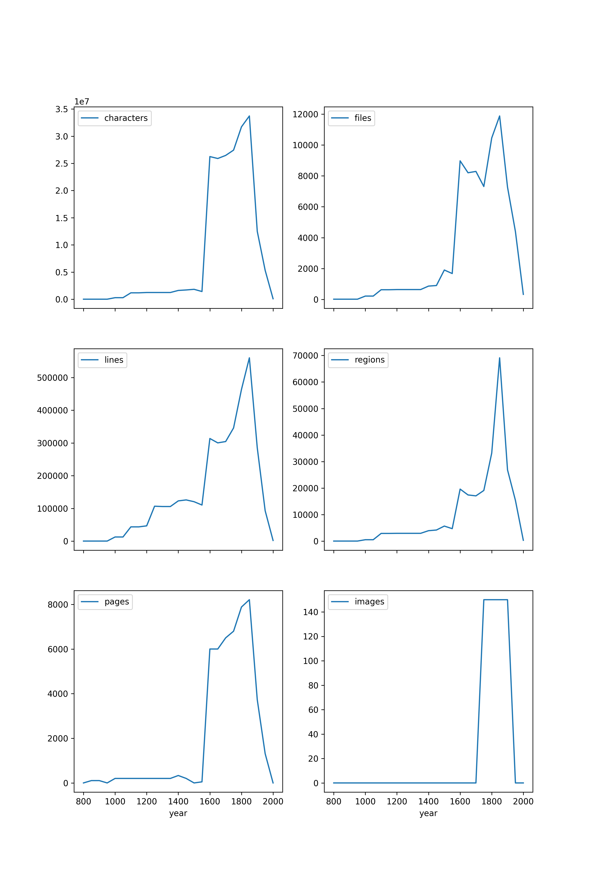

HTR-United
=========

[](./README.fr.md) [](https://htr-united.github.io) 


## What is HTR-United

HTR-United is a Github organization without any other form of legal personality. It aims at **gathering HTR/OCR transcriptions of all periods and style of writing, mostly but not exclusively in French**. It was born from the mere necessity -for projects- to possess potentiel ground truth to rapidly train models on smaller corpora.

## What is shared?

Datasets shared or referenced with HTR-United must, at minimum, take the form of:
- an ensemble of ALTO XML and/or PAGE XML files containing either only informations on the segmentation, either the segmentation and the corresponding transcription;
- an ensemble of corresponding images. They can be shared in the form of a simple permalink to ressources hosted somewhere else, or can be the contact information necessary to request access to the images. It must be possible to recompose the link between the XML files and the image without any intermediary process such as changing the images' names;
- a documentation on the context in which the dataset was produced and the rules followed to segment and transcribed the documents. For Github repositories, this documentation is usually presented in the README.

A corpus can be sub-diveded into smaller ensembles if it seems necessary.

If you need help to compose your repository, you can check [our template](https://github.com/HTR-United/template-htr-united-datarepo)!

## Only data?

Eventually, this organization will also aim at sharing -under free licenses- models suited for requested HTR processors. This will make it possible for projects with smaller capacities to benefit from ready-to-use models. Thus, if you share your data, and according to the rythm followed by the other members, you will soon be able to use such models.

However, keep in mind there exists a virtuous circle Transcription<->Training which will eventually, we hope, considerably improve the transcriptions created by young projects starting from scratch.

## How does it work?
There are two cases:
1. [You already have data in a repository](#you-already-have-data-in-a-repository)
2. [You don't have one and prefer to help the organization directly](#you-dont-have-one)
    
### You already have data in a repository

It's rather convinient: you stay in control, and there's no issue with joining the organization. However, if you want your dataset to gain visibility, it seems important to us that you describe it here. In deed, if you take benefit from data or models provided by HTR-United, you may as well contribute!

To do so, you just need to [open an issue](https://github.com/HTR-United/htr-united/issues/new) or request an update on the deposit repository by adding a YAML file generated with [our form](https://htr-united.github.io/document-your-data.html), presented as follows:

```yaml
    schema: https://htr-united.github.io/schema/2021-10-15/schema.json
    title: My Example Dataset
    url: http://link.to.repository
    authors:
      - name: John
        surname: Doe
        roles:
          - transcriber
      - name: Jeanne
        surname: Dupont
        roles:
          - project-manager
    description: A short description of the content of the dataset.
    project-name: My Awesome Project
    project-website: http://optional.link.to.project
    language:
      - fra
    script:
      - Latn
    script-type: only-manuscript
    time:
      notBefore: '1830'
      notAfter: '1875'
    hands:
      count: '1'
      precision: exact
    license:
      - name: CC-BY 4.0
        url: https://creativecommons.org/licenses/by/4.0/
    format: Page-XML
    volume:
      - metric: pages
        count: 42
      - metric: lines
        count: 420
      - metric: characters
        count: 4200
    transcription-guidelines: A presentation of the rules established for the transcription.
```

### You don't have one
Well, we'll be happy to get help from you. [Open an issue here](https://github.com/HTR-United/htr-united/issues/new) and we will gladly help to create and share your repository on HTR-United. Skills with `git` are appreciated but, if you want to share data, we will help you. It's the purpose of this organization!

## Overview 

You can browse the content of the catalog from out website: [here](https://htr-united.github.io/catalog.html).

Here is an overview of the periods covered by the datasets documented in HTR-United's catalog!



## Quality Check

To help you improve and guarantee the quality of your dataset, we developped a series of tools which can easily be add to your repositories. Check out our [Tools](https://htr-united.github.io/tools.html) webpage to see descriptions and demos!

- [HTRUC](https://github.com/HTR-United/HTRUC)
- [HUMGenerator](https://github.com/HTR-United/htr-united-metadata-generator)
- [HTVX](https://github.com/HTR-United/HTRVX)
- [ChocoMufin](https://github.com/ponteIneptique/choco-mufin)


## Publications

- (FR) Alix Chagué, Thibault Clérice, Laurent Romary. HTR-United : Mutualisons la vérité de terrain !. *DHNord2021 - Publier, partager, réutiliser les données de la recherche : les data papers et leurs enjeux*, MESHS, Nov 2021, Lille, France. [⟨hal-03398740⟩](https://hal.inria.fr/hal-03398740v1)

---

Logo by [Alix Chagué](https://alix-tz.github.io).
